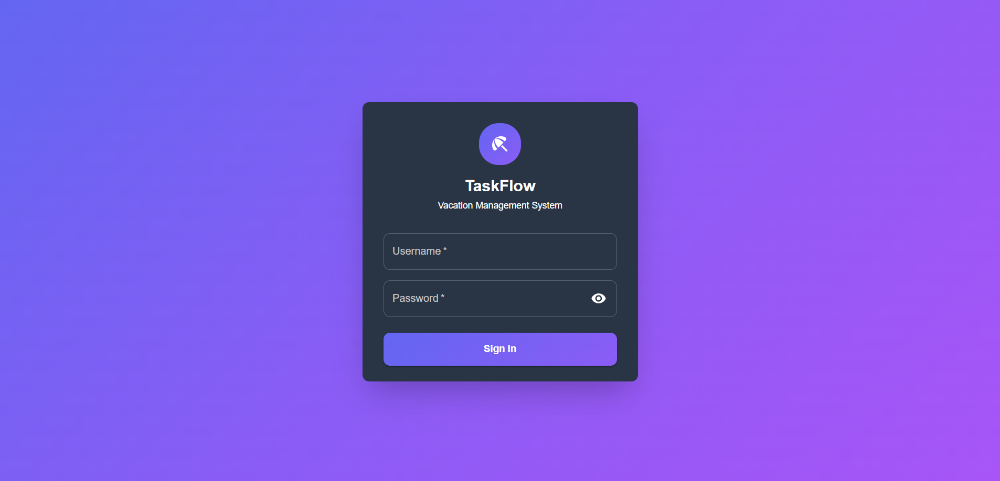
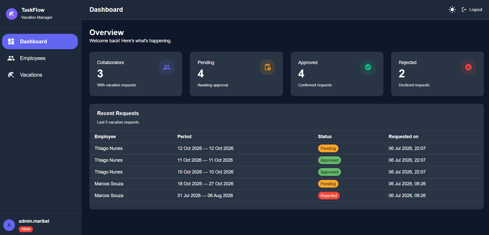
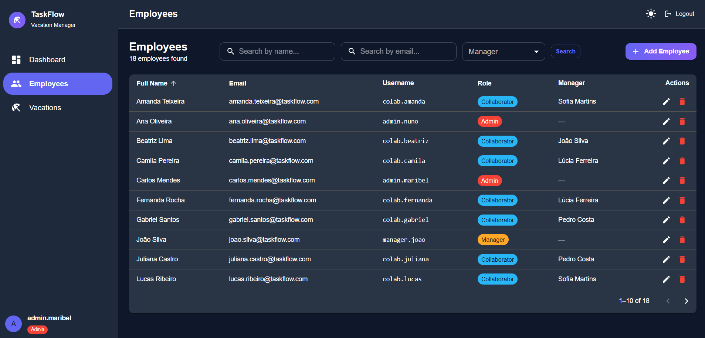
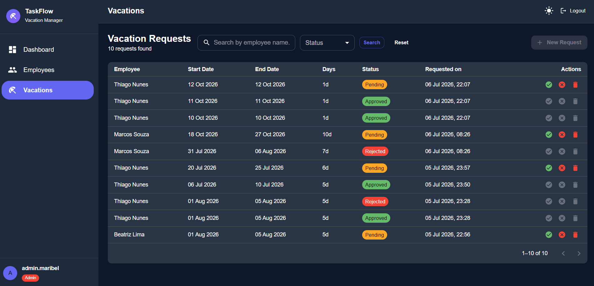

# 🏖️ TaskFlow — Vacation Management

Sistema web completo para gestão de férias de colaboradores, desenvolvido com **Spring Boot** no backend e **React** no frontend. A aplicação permite que colaboradores solicitem férias, gestores as analisem e administradores tenham controlo total sobre utilizadores e dados.

---

## ✨ Funcionalidades

- 🔐 **Autenticação JWT** com controlo de acesso baseado em roles
- 👥 **Gestão de Colaboradores** — criação, edição, listagem e desativação
- 🏖️ **Gestão de Férias** — solicitação, aprovação, rejeição e cancelamento
- 📊 **Dashboard** com resumo de férias pendentes, aprovadas e rejeitadas
- 📄 **Paginação e filtros** em todas as listagens
- 📑 **Documentação interativa da API** via Swagger UI
- 🗑️ **Soft delete** em todas as entidades (dados nunca são removidos fisicamente)
- 🔄 **Hot reload** em desenvolvimento para backend e frontend

---

## 🖥️ Screenshots

Foto da tela inicial:


Foto da tela de dashboard:


Foto da tela da listagem de employees:


Foto da tela de listagem dos vacations:


---

## 🚀 Como Executar

### Pré-requisitos

- [Docker](https://www.docker.com/)
- [Docker Compose](https://docs.docker.com/compose/)

### Inicialização

Na raiz do projeto, execute:

```bash
docker compose up
```

Na primeira execução, o Docker irá descarregar as imagens necessárias e criar todos os contentores. Este processo poderá demorar alguns minutos.

Após a inicialização, os serviços estarão disponíveis em:

| Serviço      | URL                                       |
| ------------ | ----------------------------------------- |
| **Frontend** | http://localhost:5173                     |
| **Backend**  | http://localhost:8080                     |
| **Swagger**  | http://localhost:8080/swagger-ui/index.html |

---

## 🔑 Credenciais de Acesso

O sistema cria automaticamente utilizadores de demonstração para facilitar a avaliação e os testes.

| Utilizador       | Role              | Username          | Password      |
| ---------------- | ----------------- | ----------------- | ------------- |
| Administrador    | `ADMIN`           | `maribel.admin`   | `password123` |
| Gestor           | `MANAGER`         | `manager.lucia`   | `password123` |
| Colaborador      | `COLLABORATOR`    | `colab.thiago`    | `password123` |

### Permissões por Role

| Funcionalidade                        | ADMIN | MANAGER | COLLABORATOR |
| ------------------------------------- | :---: | :-----: | :----------: |
| Criar / editar / remover colaborador  |  ✅   |   ❌    |      ❌      |
| Listar colaboradores                  |  ✅   |   ✅    |      ❌      |
| Solicitar férias                      |  ❌   |   ❌    |      ✅      |
| Editar pedido de férias               |  ❌   |   ❌    |      ✅      |
| Cancelar pedido de férias             |  ✅   |   ❌    |      ✅      |
| Aprovar / Rejeitar férias             |  ✅   |   ✅    |      ❌      |
| Visualizar todas as férias            |  ✅   |   ✅    |      ✅      |

---

## 🛠️ Stack Tecnológica

### Backend
| Tecnologia         | Versão  | Descrição                          |
| ------------------ | ------- | ---------------------------------- |
| Java               | 21      | Linguagem principal                |
| Spring Boot        | 3.5     | Framework de aplicação             |
| Spring Security    | —       | Autenticação e autorização         |
| JWT (jjwt)         | 0.12.6  | Tokens de autenticação             |
| Spring Data JPA    | —       | Persistência de dados              |
| PostgreSQL         | 17      | Base de dados relacional           |
| Flyway             | —       | Migrações de base de dados         |
| MapStruct          | 1.6.3   | Mapeamento entre DTOs e entidades  |
| Lombok             | —       | Redução de boilerplate             |
| SpringDoc OpenAPI  | 2.8.0   | Documentação automática da API     |

### Frontend
| Tecnologia         | Versão  | Descrição                          |
| ------------------ | ------- | ---------------------------------- |
| React              | 19      | Biblioteca de UI                   |
| TypeScript         | 6       | Tipagem estática                   |
| Vite               | 8       | Build tool e dev server            |
| MUI (Material UI)  | 9       | Componentes de interface           |
| React Router DOM   | 7       | Roteamento de páginas              |
| Axios              | 1.18    | Cliente HTTP                       |

---

## 🏗️ Decisões de Arquitetura

### Repositório Monorepo

Para facilitar a avaliação, o projeto foi concentrado num único repositório. Assim, é possível executar toda a aplicação com um único comando (`docker compose up`), sem necessidade de configurações adicionais.

### Package by Feature

A organização do backend segue a abordagem **Package by Feature**, agrupando todas as classes de um domínio (controller, service, repository, entity, dto) no mesmo pacote:

```
com.taskflow.vacation.management
├── auth/
├── employee/
│   ├── controller/
│   ├── domain/
│   ├── dto/
│   ├── mapper/
│   ├── repository/
│   ├── service/
│   └── validation/
├── vacation/
│   ├── controller/
│   ├── dto/
│   ├── entity/
│   ├── mapper/
│   ├── repository/
│   ├── service/
│   └── validation/
├── user/
│   ├── controller/
│   ├── dto/
│   ├── entity/
│   ├── repository/
│   ├── service/
│   └── validation/
└── common/
```

Esta abordagem foi escolhida porque os domínios de negócio estão bem definidos. Ao agrupar as classes por funcionalidade, obtém-se maior coesão, melhor organização e navegação mais simples durante o desenvolvimento e manutenção.

### Soft Delete

Todas as entidades utilizam **soft delete** — ao remover um registo, apenas o campo `deleted_at` é preenchido. Os dados nunca são eliminados fisicamente da base de dados, garantindo auditoria e rastreabilidade.

### Segurança

A autenticação é feita via **JWT**. Cada endpoint é protegido com `@PreAuthorize`, garantindo que apenas utilizadores com as roles corretas podem aceder a cada recurso.

---

## 📡 API — Endpoints Principais

A documentação completa e interativa está disponível em:
**http://localhost:8080/swagger-ui/index.html**

### Autenticação
| Método | Endpoint       | Descrição            |
| ------ | -------------- | -------------------- |
| `POST` | `/v1/auth/login` | Autenticação e obtenção do JWT |

### Colaboradores
| Método   | Endpoint              | Role necessária       | Descrição                  |
| -------- | --------------------- | --------------------- | -------------------------- |
| `POST`   | `/v1/employees`       | ADMIN                 | Criar colaborador          |
| `GET`    | `/v1/employees`       | ADMIN, MANAGER        | Listar colaboradores       |
| `GET`    | `/v1/employees/{id}`  | ADMIN, MANAGER        | Detalhe do colaborador     |
| `PUT`    | `/v1/employees/{id}`  | ADMIN                 | Atualizar colaborador      |
| `DELETE` | `/v1/employees/{id}`  | ADMIN                 | Desativar colaborador      |

### Férias
| Método    | Endpoint                      | Role necessária              | Descrição                   |
| --------- | ----------------------------- | ---------------------------- | --------------------------- |
| `POST`    | `/v1/vacations`               | COLLABORATOR                 | Solicitar férias            |
| `GET`     | `/v1/vacations`               | ADMIN, MANAGER, COLLABORATOR | Listar férias               |
| `GET`     | `/v1/vacations/summary`       | ADMIN, MANAGER, COLLABORATOR | Resumo de férias            |
| `GET`     | `/v1/vacations/{id}`          | ADMIN, MANAGER, COLLABORATOR | Detalhe de férias           |
| `PUT`     | `/v1/vacations/{id}`          | COLLABORATOR                 | Atualizar pedido            |
| `DELETE`  | `/v1/vacations/{id}`          | ADMIN, COLLABORATOR          | Cancelar pedido             |
| `PATCH`   | `/v1/vacations/{id}/approve`  | ADMIN, MANAGER               | Aprovar pedido              |
| `PATCH`   | `/v1/vacations/{id}/reject`   | ADMIN, MANAGER               | Rejeitar pedido             |
